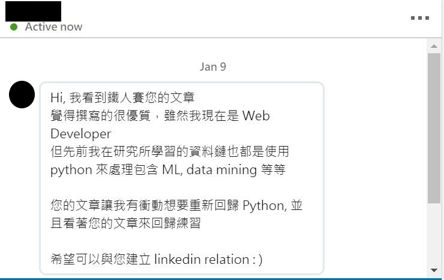

## Intorduction 
This is a repository collcting the code written in iThome competition essays: [Data and Machine Learning in NLP aspect(玩轉資料與機器學習-以自然語言處理為例)](https://ithelp.ithome.com.tw/users/20107576/ironman/1450)

## Restult

Google Translation: 
Hi, I see your article on Iron Man
Feel very good writing, although I am now a Web Developer
But the data chain that I studied at the institute previously also uses Python to handle ML, data mining, etc.

Your article made me impulsive and wanted to return to Python, and looked at your article to return to practice

Hope to establish a relationship with you:)